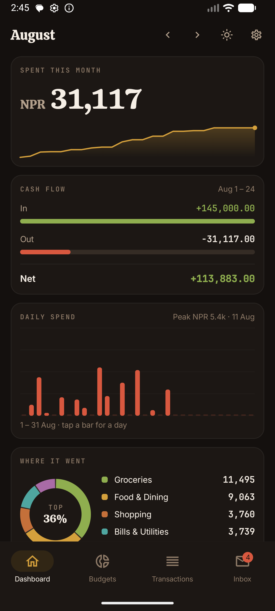
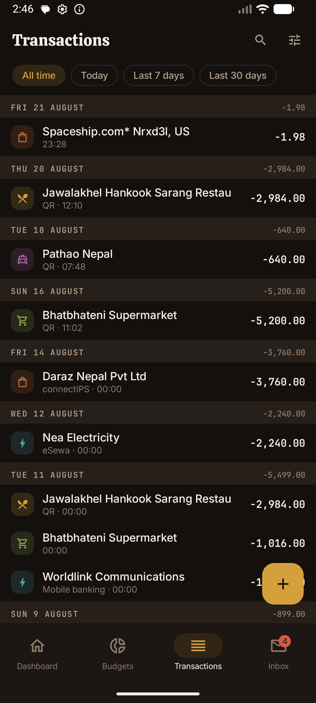
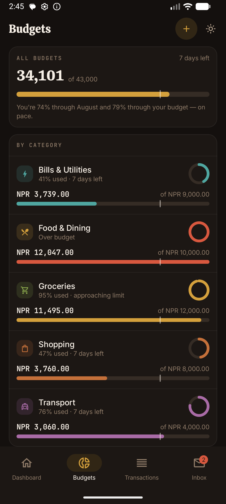
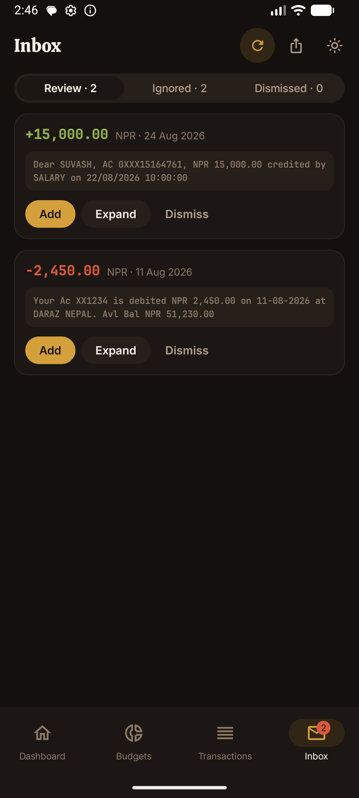
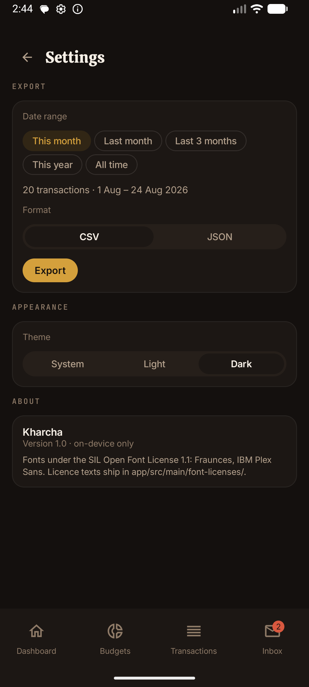
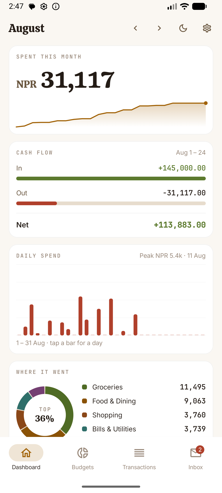

# Kharcha

An Android expense tracker for [Siddhartha Bank](https://siddharthabank.com) accounts.

The bank has no API. What it does have is an SMS alert for every transaction, so Kharcha
reads those alerts, parses them into transactions, categorises them and shows you where
your money went. Nothing leaves the phone — there is no account, no server and no network
call anywhere in the app.

*Kharcha* (खर्च) is Nepali for expense.

<p align="center">
  
  
  
</p>

## What it does

**Reads the bank's SMS alerts.** A broadcast receiver picks up each `SBL_Alert` message as
it arrives and hands it to a worker, which parses and stores it. Granting SMS permission
on first launch also backfills everything already sitting in your inbox, so the app is
useful the moment you install it rather than a month later.

**Keeps every raw message forever.** Parsing rules improve; the messages they were wrong
about should not be lost. Every SMS is stored verbatim alongside whatever was extracted
from it, and history can be re-parsed as the rules get better. Your hand-set categories
survive that re-parse.

**Never guesses.** A message the parser only partly understands becomes an *Unrecognized*
message in the Inbox, not a transaction with invented fields. A wrong transaction is worse
than a missing one — it quietly corrupts every total on the dashboard, and you have no way
to notice.

**Categorises, and learns.** Correcting a category offers to save it as a rule, so the next
message from that merchant lands in the right place on its own.

### The four screens

|  |  |
|---|---|
| **Dashboard** | Month-to-date spend, cash flow in/out/net, daily spend, where it went by category, recurring charges, and a few plain-language observations. NPR only — mixing currencies in one total is how you get a number that means nothing. |
| **Budgets** | A per-category monthly limit with a pace marker: the tick showing where you *would* be if you spent evenly across the month. A bar well past its own tick is the whole point of the screen. |
| **Transactions** | Every transaction with its real merchant and the rail it moved over — eSewa, connectIPS, IBFT, QR — with day headers carrying their own subtotals. Search, date filters, manual entry, and per-transaction edit. |
| **Inbox** | Messages the parser could not place, split into **Review** (probably a transaction — add it, or dismiss it) and **Ignored** (OTPs, password changes, promos — not transactions at all). This tab is the early warning that the bank changed its message format. |

<p align="center">
  
  
  
</p>

Export from Settings writes CSV or JSON over a date range you choose, through the system
file picker, so the file lands wherever you want it.

## Building

Needs JDK 21 and the Android SDK (build-tools 35, platform 35, minSdk 26).

```bash
export ANDROID_HOME=$HOME/Android/Sdk
./gradlew test              # :parser, :data and :app unit tests
./gradlew :app:assembleDebug
```

The APK lands in `app/build/outputs/apk/debug/app-debug.apk`. Install it over USB with
`adb install -r`, or copy it to the phone and tap it (you will have to allow installs from
unknown sources).

On first launch the app explains why it wants SMS access before asking for it. Denying
leaves the app fully usable in manual-entry-only mode, with a banner offering to ask again.

### This is a sideload build

`RECEIVE_SMS` and `READ_SMS` are Play-restricted permissions. An SMS-reading expense
tracker is not a use case Google grants an exemption for, so this is a personal build you
sideload — it is not, and will not be, on the Play Store.

## How it is put together

Three modules, and the boundary between them is load-bearing:

- **`:parser`** — pure Kotlin, zero Android dependencies. All the message formats and the
  logic that turns text into a transaction live here, which keeps them fast to test: the
  parser suite runs on the JVM in about a second. Do not add an Android dependency to this
  module.
- **`:data`** — Room. Transactions, categories, rules, budgets, and the raw-message archive.
- **`:app`** — Compose UI, plus ingestion (`BroadcastReceiver` → WorkManager) and
  notifications.

### Rules the code holds to

These are not style preferences; breaking one is a defect.

- **Money is `Long` minor units.** Never `Double`, never `Float`, anywhere, including
  intermediate arithmetic. NPR 2,984.00 is `298400L`.
- **Currency is explicit on every amount.** NPR and USD both occur, and they are never
  summed or converted. The app has no exchange rate and no business inventing one.
- **Parse failure is a returned value, never an exception.** `parse()` runs inside an SMS
  broadcast pipeline; it must not throw on any input, however malformed.
- **A partially-understood message is `Unrecognized`, never a guess.**
- **Re-parsing preserves manual overrides.** A category you set by hand survives every
  later improvement to the rules.

### The messages themselves

Three families arrive from `SBL_Alert`, and they do not agree with each other:

1. **NPR account** — `Dear SUVASH, AC 0###15164761, NPR 2,984.00 withdrawn on 17/07/2026
   12:10:01 for QR Payment to JAWALAKHEL HANKOOK SARANG RESTAU`. Dates are
   `dd/MM/yyyy HH:mm:ss`, and the trailing remark **is cut off by the SMS length limit**,
   so merchant matching has to be prefix-tolerant.
2. **USD card** — `SBL Card ***5367 used at SPACESHIP.COM* NRXD3L, US for USD 1.98 on
   02.08.26 23:28 Authid 512208 Remaining Balance after txn USD 241.22.` A *different*
   date format, and a balance the NPR messages do not carry.
3. **Not transactions** — OTPs and purchase codes, matched and discarded *before* any
   transaction pattern is tried. A purchase-code message contains a date, a currency and an
   amount, and would otherwise parse into a transaction that never happened.

The rail and the counterparty are separate things and are kept apart. `Fund Trf to NEA
ELECTRICITY ESEW` is a payment to NEA (the merchant) that travelled over eSewa (the
channel). Folding those together would make the same shop reached over two wallets look
like two different merchants.

## Status

v2 is complete: the design system, all four screens, Settings and export are built, tested
and playtested. See [`docs/V2-STATE.md`](docs/V2-STATE.md) for the decisions behind the
redesign and [`HANDOFF.md`](HANDOFF.md) for the v1 background.

Known gaps:

- Six ignore rules (password changed, balance enquiry, card activation, promos, declines,
  login alerts) were written against invented phrasing, since no real samples of those
  messages were available. They fail safe — a mismatch leaves the message in the Inbox
  rather than discarding it wrongly — but they may simply never fire.
- The permission walkthrough on a fresh install, backfill against a real OEM SMS provider,
  budget notifications posting, multipart (>160 character) message reassembly, and the Room
  1→2 migration have all been tested on an emulator but not on real hardware.

## Licence

Personal project, no licence granted. The bundled fonts are under the SIL Open Font
License 1.1 — Calistoga, Inter and JetBrains Mono — with their licence texts in
`app/src/main/font-licenses/`.
